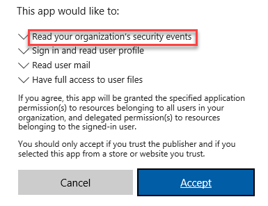
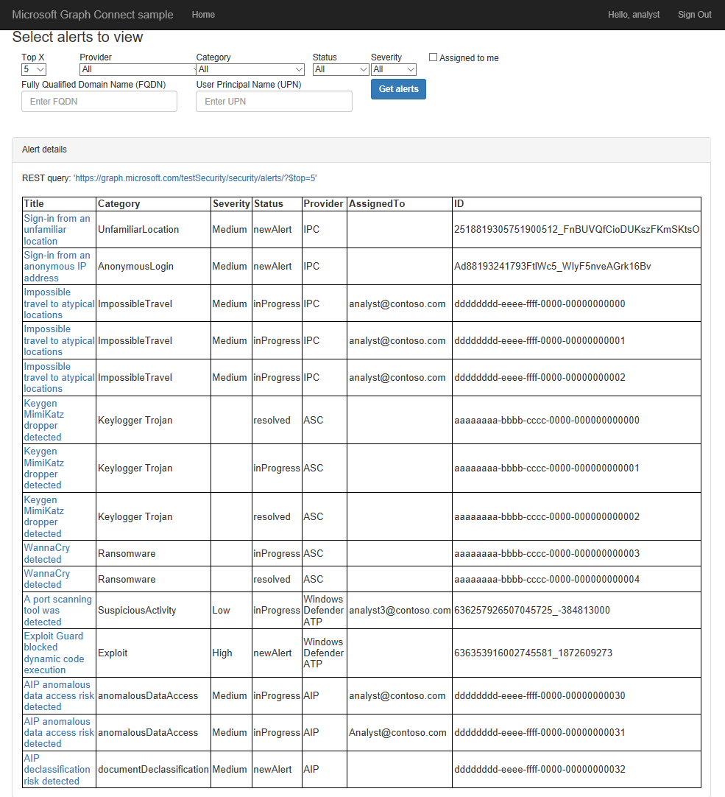
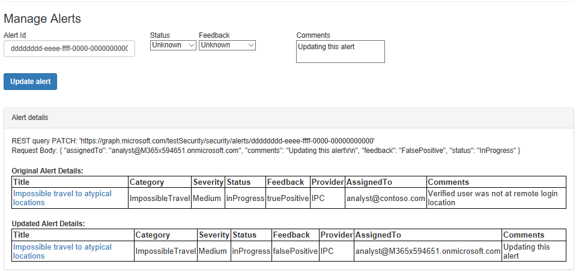
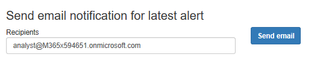

# Python Web App demo using Microsoft Intelligent Security Graph

 

Microsoft Graph provides REST APIs for integrating with Intelligent Security Graph providers that enable your app to retrieve alerts, update alert lifecycle properties, and easily email an alert notification. This sample consists of a Python web application that invokes common Microsoft Graph security API calls, using the [Requests](http://docs.python-requests.org/en/master/) HTTP library to call these Microsoft Graph APIs:

| API                 | Endpoint                                   |      |
| ------------------- | ------------------------------------------ | ---- |
| Get Alerts          | /security/alerts                           | [docs](https://developer.microsoft.com/en-us/graph/docs/api-reference/beta/resources/alert)  |
| Get user profile    | /me                                        | [docs](https://developer.microsoft.com/en-us/graph/docs/api-reference/v1.0/api/user_get) |
| Send mail           | /me/microsoft.graph.sendMail               | [docs](https://developer.microsoft.com/en-us/graph/docs/api-reference/v1.0/api/user_sendmail) |

For additional information about this sample, see [Get started with Microsoft Graph in a Python app](https://developer.microsoft.com/en-us/graph/docs/concepts/python
).

* [Installation](#installation)
* [Running the sample](#running-the-sample)
* [Sendmail helper function](#sendmail-helper-function)
* [Contributing](#contributing)
* [Resources](#resources)

## Installation

To install and configure the samples, see the instructions in [Installing the Python REST samples](https://github.com/microsoftgraph/python-sample-auth/blob/master/installation.md). Note that the samples in this repo require **User.Read**, **Mail.Send**, **SecurityEvents.Read.All**, and **SecurityEvents.ReadWrite.All** permissions.

After you've completed those steps and have received [admin consent](#Get-Admin-consent-to-view-Security-data) for your app, you'll be able to run the ```sample.py``` sample as covered below.

## Get Admin consent to view Security data

1. Provide your Administrator your **Application Id** and the **Redirect URI** that you used in the previous steps. The organization’s Admin (or other user authorized to grant consent for organizational resources) is required to grant consent to the application.
2. As the tenant Admin for your organization, open a browser window and craft the following URL in the address bar:
https://login.microsoftonline.com/common/adminconsent?client_id=APPLICATION_ID&state=12345&redirect_uri=REDIRECT_URL
Where APPLICATION_ID is the application ID and REDIRECT_URL is the Redirect URL values from the App V2 registration portal after clicking on your application to view its properties.
3. After logging in, the tenant Admin will be presented with a dialog like the following (depending on which permissions the application is requesting):

   

4. When the tenant Admin agrees to this dialog, he/she is granting consent for all users of their organization to this application.

## Running the sample

1. At the command prompt: ```python sample.py```
2. In your browser, navigate to [http://localhost:5000](http://localhost:5000)
3. Choose **Sign in with Microsoft** and authenticate with a Microsoft *.onmicrosoft.com identity.

A form that allows building a filtered alert query by selecting values from drop down menus:
-
By default, the top 5 alerts from each security API provider will be selected. But you can select to retrieve 1, 5, 10, or 20 alerts from each provider.

After you've selected your choices, click on **Get alerts**. A REST call will be sent to the Microsoft Graph, and a table with all the received alerts will be displayed below the form:



In the next section you'll see a "Manage Alerts" form where you can update lifecycle properties for a specific alert - by alert ID.
Once the alert is updated the metadata of the original alert is displayed above the updated alert.



Finally, the app enables sending an email notification of the latest alert to be sent from the signed in user's email account that contains information about the alert including the alert ID that allows viewing the alert.



This sample uses _delegated permissions_ to send mail on behalf of the currently authenticated user, identified as 'me' in Graph API calls. You can also send mail on behalf of other users, if you have administrator consent for the appropriate _application permissions_. See the [Microsoft Graph permissions reference](https://developer.microsoft.com/en-us/graph/docs/concepts/permissions_reference) for more information about Graph's permission model.

## Contributing

These samples are open source, released under the [MIT License](https://github.com/microsoftgraph/python-security-rest-sample/blob/master/LICENSE). Issues (including feature requests and/or questions about this sample) and [pull requests](https://github.com/microsoftgraph/python-security-rest-sample/pulls) are welcome. If there's another Python sample you'd like to see for Microsoft Graph, we're interested in that feedback as well &mdash; please log an [issue](https://github.com/microsoftgraph/python-security-rest-sample/issues) and let us know!

This project has adopted the [Microsoft Open Source Code of Conduct](https://opensource.microsoft.com/codeofconduct/). For more information, see the [Code of Conduct FAQ](https://opensource.microsoft.com/codeofconduct/faq/) or contact [opencode@microsoft.com](mailto:opencode@microsoft.com) with any additional questions or comments.

Your feedback is important to us. Connect with us on [Stack Overflow](https://stackoverflow.com/questions/tagged/microsoft-graph-security). Tag your questions with [Microsoft-Graph-Security].

## Resources

Documentation:

* [Use the Microsoft Graph to integrate with Security API](https://developer.microsoft.com/en-us/graph/docs/api-reference/beta/resources/security-api-overview)
* Microsoft Graph [List alerts](https://developer.microsoft.com/en-us/graph/docs/api-reference/beta/api/alert_list) documentation
* [Microsoft Graph permissions reference](https://developer.microsoft.com/en-us/graph/docs/concepts/permissions_reference)

Samples:

* [Python authentication samples for Microsoft Graph](https://github.com/microsoftgraph/python-sample-auth)
* [Sending mail via Microsoft Graph from Python](https://github.com/microsoftgraph/python-sample-send-mail)
* [Working with paginated Microsoft Graph responses in Python](https://github.com/microsoftgraph/python-sample-pagination)
* [Working with Graph open extensions in Python](https://github.com/microsoftgraph/python-sample-open-extensions)

Packages:

* [Flask-OAuthlib](https://flask-oauthlib.readthedocs.io/en/latest/)
* [Requests: HTTP for Humans](http://docs.python-requests.org/en/master/)

Copyright (c) 2018 Microsoft Corporation. All rights reserved.
